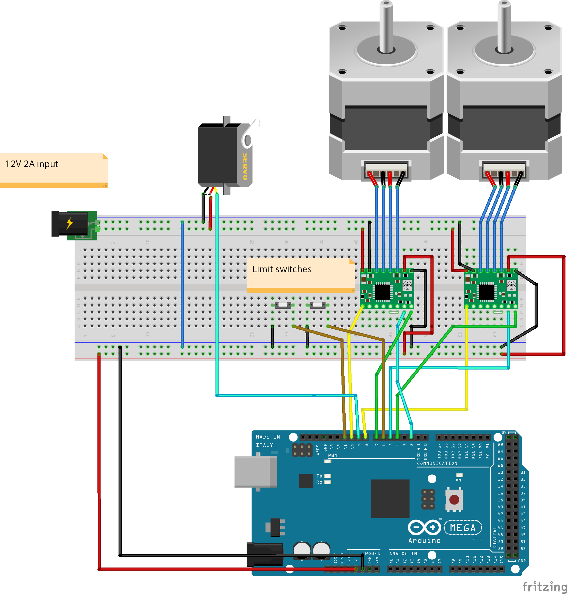

# AILU firmware 

## Project description:

 Design a python module able to control stepper motors and servos, by sending commands to an Arduino through serial. 

The frimware running on the Arduino is saved under:
/servo_controls/servo_contols.ino, 

The python script sending the commands is saved as motor-controls.py

## Project requirements:

Python script should be able to control all three mototors (Horizontal, Vertical and Servo) and be able to stop them at any time. 

It would be awesome to have methods like those:

    Robot.cw() # continuously move clock-wise
    Robot.ccw() # continuously move counter-clock-wise
    Robot.up() # Move up 1 step
    Robot.Down() # Move down 1 step
    Robot.sevro(<degree>) # Move servo up or down
    Robot.stopHorziontal()
    Robot.stopVertical()

Make sure to take in consideration the limit switches, stop the motor if a limit switch is closed.

## Important Details

I commented the code to hopefully make it easier to understand it, but here are some important details:

1. Make sure you have Python 3 installed 

2. On my PC the serial port to comunicate with the arduino is COM7, it might be different on your PC, so check what it is and change it in the Pyhton code, (it should tell you what the COM is in the bottom right corner of the Arduino IDE). 

3. The Python program uses a module called serial, you need to dowlnload it by running "pip install pyserial" in your power shell. 

4. currently the robot is controlled by sending a string like this: "a200" the first letter "a" is the direction to go: 
    - "a" is clock-wise, 
    - "d" is counter-clock-wise, 
    - "w" is up, 
    - "s" is down
    - "o" is the servo

    followed by a number representing steps to take for the stepper motors and the angle for the servo.
    The Horizontal stepper axis has 355 steps, the vertical stepper axis has 350 steps, and the servo can move between 0 and 270 degree

## Schematics

Thank you so much for working with me on this project, it will be a tone of fun, feel free to change things that you want.

