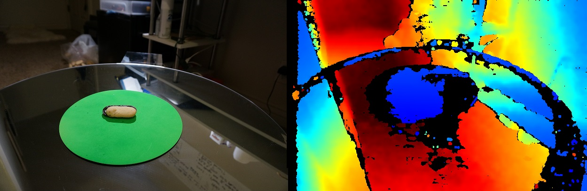
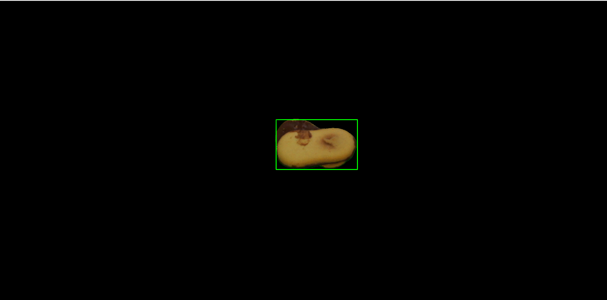
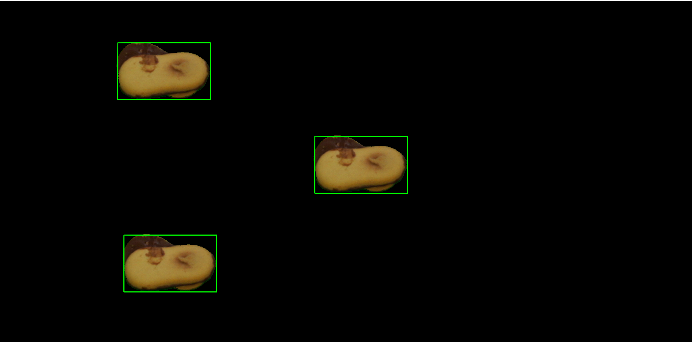
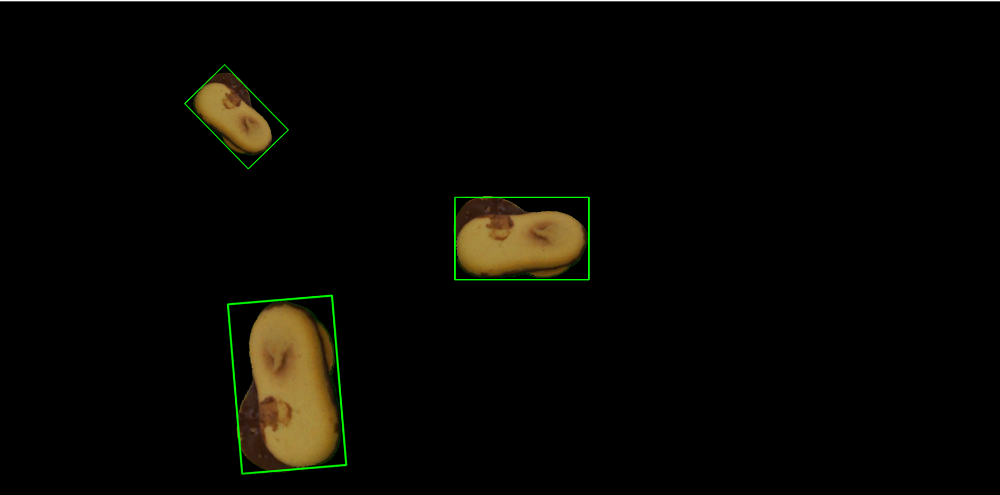
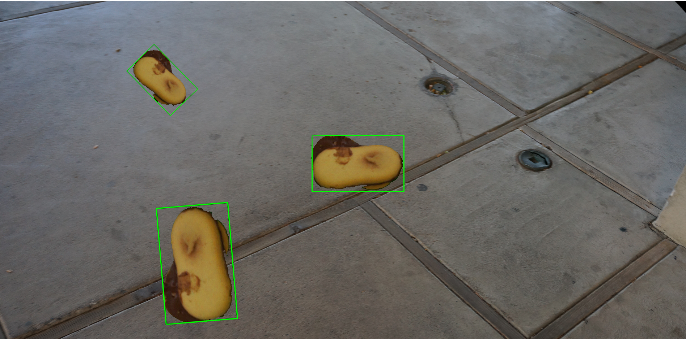
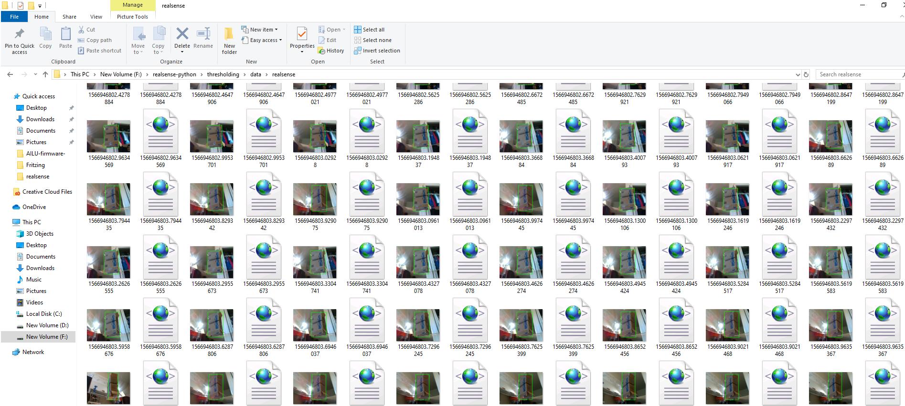

# AILU

_The information disclosed in the document is confidential and you are not allowed to
 share or distribute it with anyone._
 
## Description:

The AILU module has the goal of helping us isolate objects of interest that need to be
imaged, as well as finding teh region of interest around that object and finally 
augmenting the data to allow for more accurate computer models in diverse environments.

## Organization & Links

The module is called ailu_python and includes functions to process the images, augment data, and 
other utilities.

#### Module: [ailu_python](ailu_python):
-   [ailu_python.image_processing](ailu_python/image_processing) 
-   [ailu_python.data_augmentation](ailu_python/data_augmentation)
-   [ailu_python.utils](ailu_python/utils)

#### robot_controls:
-  [basic files to control the AILU robot](robot_controls)

#### examples:
-   several simple examples on how to use the ailu_python module
-   test data that you can use

## General process 

### Step1: obtain the data

We obtain data by simply having the robot film around the object in small video files
of about 20 seconds. We use both depth video from intel realsense and color video from 
a sony camera.

This is what the raw images look like: 

Sony NEXT5 T  and the intel realsense D435i

### Step2: process the data

Once we have those images we can process them to get a precise image of the object, with all the 
rest completely blacked out.

For this steps we use ailu_python.image_processing.getObject.using_depth_and_green(). To get the object of interest.

we use:
    
    ailu_python.image_processing.getObject.using_depth_and_green(color_image, depth_image, 0.16)

This is what the result looks like:

We then save all those images into a video file.

### Step3: augment the data

Now that we have a video file with hundreds of blacked out images, we can find the ROI, modify it
and then put a new background instead of the black pixels

sample video file in ./examples/data/output.avi

Load the video, and frame by frame do the following:

Get the ROI using

    rois = getROI.using_color(<frame from the video>)

Remember that we won't actually draw the green rectangle, we will just get the x,y coordinates

Then duplicate the ROI (between 1 and 6 copies):

Now modify each ROI:

Now add a random background:

### Step4: save the data

Save the image as png along with an xml file that contains the coordinates of all the ROI.

Here is an example of what the folder would look like:

### Step5: prepare the data for training:

This is a basic representation of those steps:

