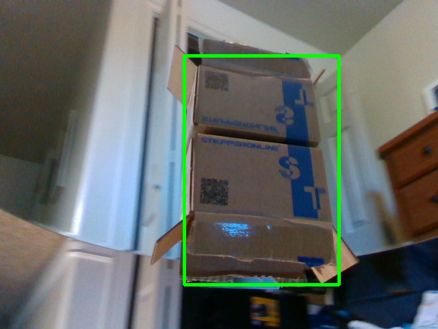
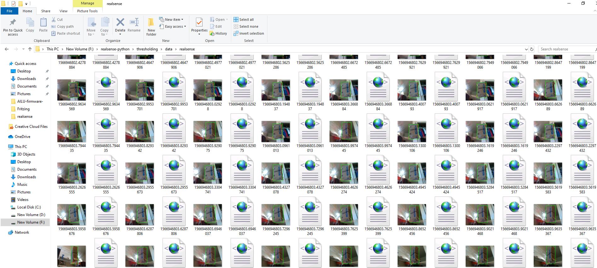
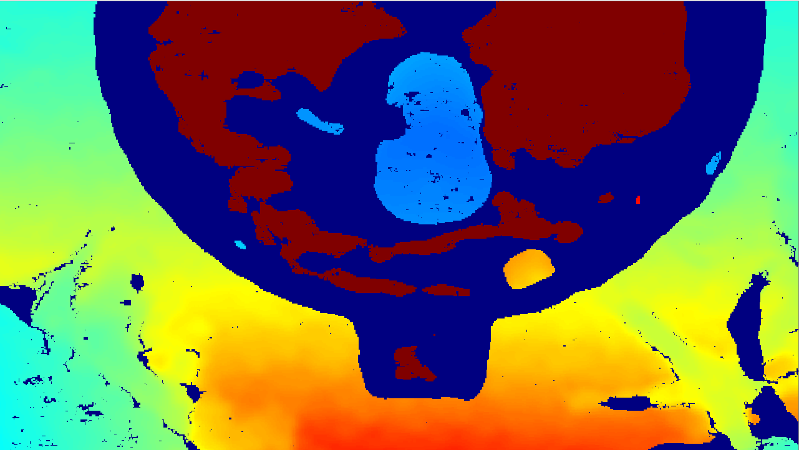
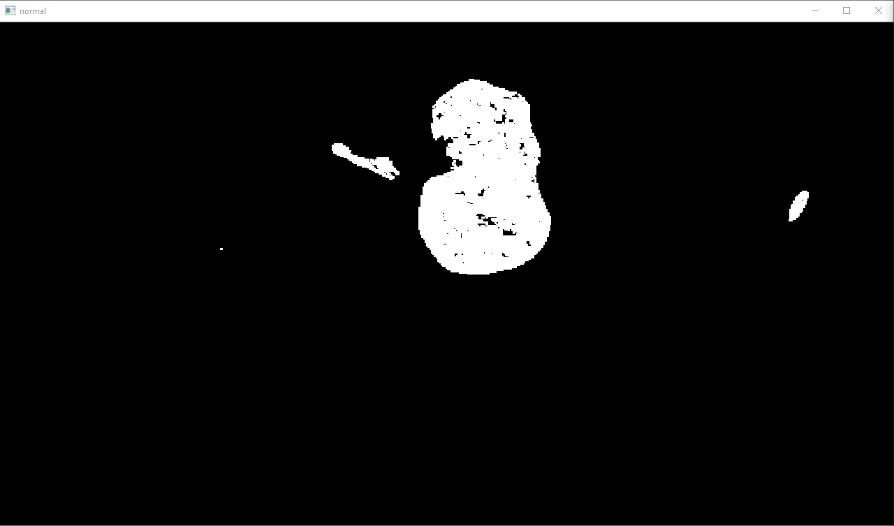
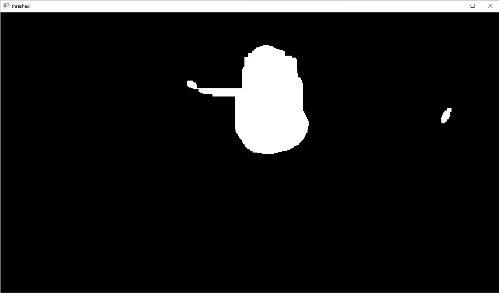
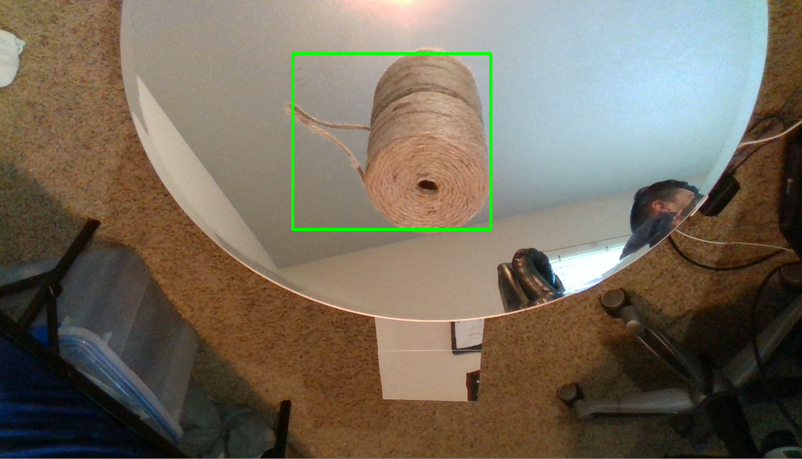

# AILU

Points:
-  description of the project
-  how to do object detection
-  the big picture
-  This is a startup, expectations
____

## Description of the AILU project:

AILU stands for Automated Imaging and Labeling Unit, the purpose of this robot is to take images of object, lots of images of lots of objects.

Why? We want to make robots able to recognize any objects, especially weird and unfamilliar ones, and many companies have werd objects that they want their robots to recognize, currently it's not possible for them to obtain the object detection model that they need. And there is a market wide open for us.

____

## Object detection

We plan on using the tensorflow object detection API to train our computer models on, this tool is very easy to use and give us great flexibility.

The basics of how to use the API goes as follow:

### 1 Images:
We need a lot of images, especially if we need to recognize a lot of different objects, here is an example of images (the green box will not be used in the actual images)

And an XML file with the same name, that contains the metadata of the object:

    <?xml version="1.0"?>

    -<annotation>
        <folder>realsense</folder>
        <filename>1566946802.2614963.png</filename>
        <path>F:/realsense-python/thresholding/data/realsense/1566946802.2614963.png</path>

        -<source>
            <database>AndroBotics</database>
        </source>

        -<size>
            <width>640</width>
            <height>480</height>
            <depth>3</depth>
        </size>
        <segmented>0</segmented>

        -<box>
            <name>little box</name> // name of the object
            <pose>Unspecified</pose>
            <truncated>0</truncated>
            <difficult>0</difficult>

            -<bndbox>             // position of the object 
                <xmin>269</xmin>
                <ymin>81</ymin>
                <xmax>495</xmax>
                <ymax>415</ymax>
            </bndbox>
         </box>
    </annotation>

So the data folder ends up looking somethings like this:

### 2 formating the data and training the model:

__Step1:__ All the XML files are converted to CSV 

__Step2:__ The CSV file along with the images are convered to a tf_record file 

__Step3:__ The tf_record file is consumed by the training model

__Step4:__ Boom you have a trained computer model

__Step5:__ ????

__Step6:__ Profit

## The Ailu Robot
____

The Ailu robot works in the following way, it simply sping arounf teh object, while filing at 30 fps, and it creates 2 types of images,
A color image and a depth Images.

#### first we take the depth image and apply color to it:

#### Then we only keep the blue color and turn all the rest black:

#### Then we apply a couple filters:

#### Now that we have a precise region of intrest we can simply overlap the two images, and get that same region in the color image

The coordinates / metadata and the images are then saved under the same name, one as a XML file and one as a PNG file. The robot can get 300 images in 10 seconds, making it possible to get 105,000 images in 30 minutes.  
Adding on top of that the data augmentation techniques will increase that x10. 

### The PLan for AILU:

So far the Ailu robot has Three major components:

-    A firmware that controls the actual motors of the robot, This is coded in C++ and running on an Arduino Mega
-    A CLient that conrols the robot and that starts and stops the recording of the camera 
-    An image processing script that loads the video recorded by the client and does all the figuring out of where is the object and then saves the image along with the XML file

#### In the future:

We want to have the image processing all done on one central server, so the client would jsut record the files, and sends them to the server.

Like this:

